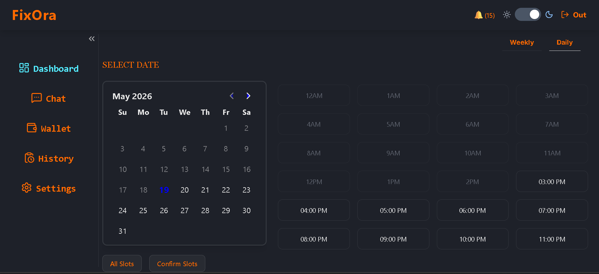
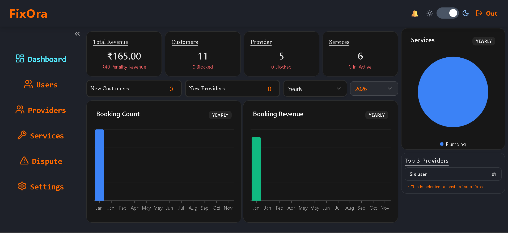
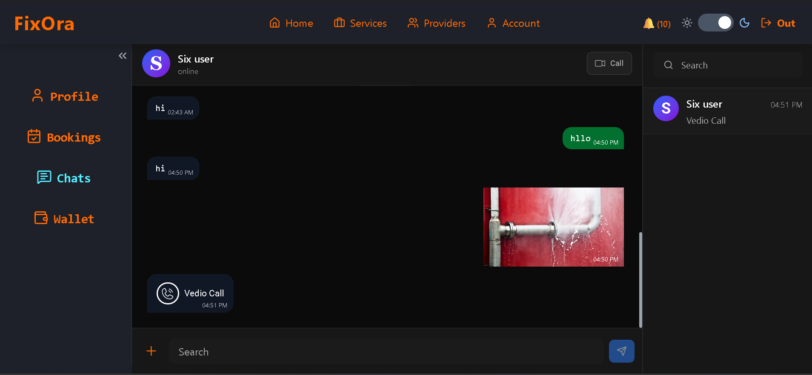
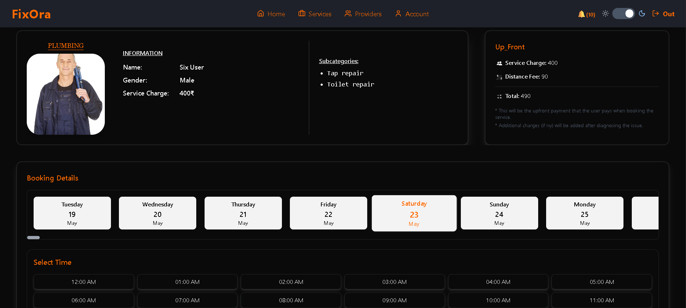

# FixOra

FixOra is a full-stack service booking platform that connects users with verified service providers through a secure and real-time workflow system.

The platform supports multiple roles including users, providers, and admins, each with dedicated functionalities and dashboards.

---

# Features

## User Features

- Browse and book service providers
- Reschedule or cancel bookings
- Real-time chat with providers
- Video consultation before booking
- Booking notifications
- Secure online payments
---

## Provider Features

- Manage booking requests
- Accept or reject bookings
- Configure weekly availability and slots
- Manage expertise and service categories
- Track booking history and earnings

---

## Admin Features

- User and provider management
- Provider KYC approval system
- Service and sub-service management
- Dispute and report handling
- Commission management
- Revenue and analytics monitoring

---

# Technical Highlights

- Role-Based Access Control (RBAC)
- JWT Authentication with HTTP-only Cookies
- Real-Time Communication using Socket.IO
- Video Calling with ZegoCloud
- Firebase Push Notifications
- Stripe Payment Integration
- Winston Logging System
- Route-Level Rate Limiting
- Clean Architecture Inspired Backend
- AWS EC2 + Nginx Deployment

---

# Tech Stack

## Frontend
- React.js
- TypeScript
- Redux Toolkit
- Tailwind CSS
- Chad-cn

## Backend
- Node.js
- Express.js
- TypeScript

## Database
- MongoDB

## Services & Tools
- Socket.IO
- Firebase
- Stripe
- ZegoCloud
- AWS EC2
- Nginx

---

# Project Structure

```bash
Front-End/
Back-End/
```

---

# Screenshots

## landing Page


---

## Provider Dashboard



---

## admin Dashboard



---

## Chat System



---

## booking



---

# Installation

## Clone Repository

```bash
git clone https://github.com/jomi087/FixOra.git
```

---

## Frontend Setup

```bash
cd Front-End
npm install
npm run dev
```

---

## Backend Setup

```bash
cd Back-End
npm install
npm run dev
```

---

# Environment Variables

Create a `.env` file inside the server folder.

NODE_ENV=
PORT=
MONGO_URL=
FRONTEND_URL=

## JWT
### signup
JWT_TEMP_ACCESS_SECRET=
JWT_TEMP_ACCESS_TOKEN_EXPIRY=

### arival
JWT_Arival_TOKEN=
JWT_Arival_TOKEN_EXPIRY=

### resetPassword
JWT_RESET_PASSWORD_SECRET=
JWT_TEMP_RESET_TOKEN_EXPIRY=

### signin access
JWT_ACCESS_SECRET=
JWT_ACCESS_TOKEN_EXPIRY=

### signin refresh
JWT_REFRESH_SECRET=
JWT_REFRESH_TOKEN_EXPIRY=

## Node Mailer (Mail)
MAIL_USER=
MAIL_PASSWORD=

## O-Auth
GOOGLE_CLIENT_ID=
GOOGLE_CLIENT_SECRET=

## Cloudinary (Image)
CLOUDINARY_CLOUD_NAME=
CLOUDINARY_API_KEY=
CLOUDINARY_API_SECRET=

## Winston (logger)

### General (logging)
LOG_DATE_PATTERN=
LOG_ZIPPED=
LOG_MAX_SIZE=
LOG_LEVEL=
LOG_COMBINED_MAX_FILES=

### Error logs
LOG_ERROR_LEVEL=
LOG_ERROR_MAX_FILES=
LOG_HANDLE_EXCEPTIONS=

## Ola GeoCoding
OLA_API_KEY=

## Stripe Payment
STRIPE_SECRET_KEY=
STRIPE_WEBHOOK_SECRET=

## Firebase Service-A/C (pushNotification)
FIREBASE_TYPE=
FIREBASE_PROJECT_ID=
FIREBASE_PRIVATE_KEY_ID=
FIREBASE_PRIVATE_KEY=
FIREBASE_CLIENT_EMAIL=
FIREBASE_CLIENT_ID=
FIREBASE_AUTH_URI=
FIREBASE_TOKEN_URI=
FIREBASE_AUTH_PROVIDER_CERT_URL=
FIREBASE_CLIENT_CERT_URL=
FIREBASE_UNIVERSE_DOMAIN=

# Security Features

- HTTP-only cookie authentication
- Protected routes
- Role-based authorization
- API rate limiting
- Secure payment handling

---

# Deployment

The application was deployed using:

- AWS EC2
- Nginx Reverse Proxy

---

# Learning Outcomes

This project helped strengthen knowledge in:

- scalable backend architecture
- real-time systems
- secure authentication flows
- production deployment practices
- modular application design

---

# Author
JOMI